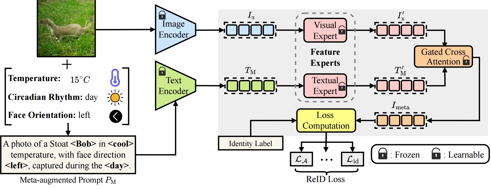
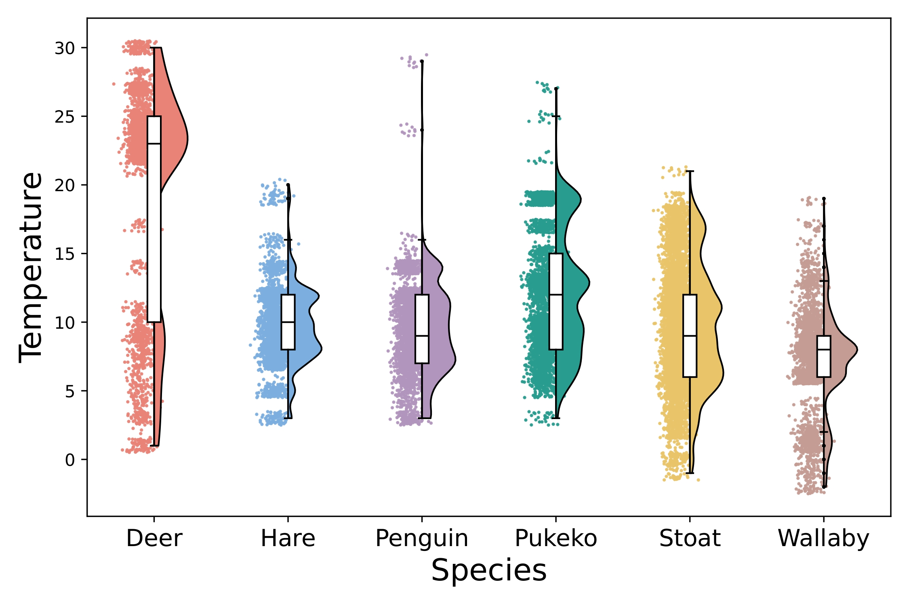

# MetaWild
## Introduction
The MetaWild dataset is a multimodal benchmark designed to improve animal re-identification (Animal ReID) by integrating environmental metadata with visual data. Unlike existing datasets that rely solely on images, MetaWild includes 20,890 images spanning six representative species, each image is paired with metadata such as temperature and circadian rhythms, providing valuable context for distinguishing individual animals. Additionally, to facilitate the use of metadata in existing ReID methods, we propose the Meta-Feature Adapter (MFA), a lightweight module that can be incorporated into existing vision-language model (VLM)-based Animal ReID methods, allowing ReID models to leverage both environmental metadata and visual information to improve ReID performance. Our experiments on MetaWild show that incorporating metadata with MFA consistently improves ReID performance over using visual data alone. We hope that our benchmark can inspire further exploration of multimodal approaches for Animal ReID.

---

## Data Availability
Our dataset is accessible through:
* [Hugging face](https://huggingface.co/datasets/lucas0927/MetaWild)

---

## Supplementary Material

<!-- Experiment settings: [Supplementary Material - Experiment](./supplementary-experiment.html) and 
Ablation study: [Supplementary Material - Ablation](./supplementary-ablation.html). -->

This section provides detailed supplementary materials to support the main findings presented in the MAAR project. Our supplementary materials are divided into two key sections:

- **Experiment Settings:** This section provides a comprehensive description of the experimental setup used in our study, including details on the benchmark dataset, baseline models, evaluation metrics, and reproducibility information. For detailed information, please refer to the following link:  
  ➡️ [Supplementary Material - Experiment Settings and Reproducibility](./supplementary-experiment.html)

- **Ablation Study:** This section presents the ablation study that explores the effect of various design choices and metadata features on ReID performance, please refer to the following link:  
  ➡️ [Supplementary Material - Ablation Study](./supplementary-ablation.html)

- **Future Direction and Community Impact:** This section presents the future directions for the MetaWild project, including potential extensions, collaborations, and community engagement initiatives. For detailed information, please refer to the following link:  
  ➡️ [Supplementary Material - Future Direction](./supplementary-futuredirection.html)

---

## Meta-Feature Adapter (MFA)
To effectively leverage environmental metadata in Animal Re-Identification (ReID), we propose the **Meta-Feature Adapter (MFA)** — a lightweight, plug-and-play module designed to integrate textual metadata with visual representations. MFA is compatible with existing Vision-Language Models (VLMs) such as CLIP, and enables **multimodal feature fusion** by aligning textual metadata with visual features.

  
  

    Figure 1: Overview of the MFA architecture integrating visual and metadata branches using feature experts and gated cross-attention.
  

### Multimodal Integration Results
We evaluate the influence of environmental metadata on Animal ReID performance using the MetaWild dataset by incorporating MFA into existing ReID methods. Experimental results show that incorporating environmental metadata consistently improves ReID accuracy across multiple baseline methods and all six species.

  <table>
    <tr>
      <td align="center">
        
         <b>CLIP-FT vs CLIP-FT+MFA</b>
      </td>
      <td align="center">
        
         <b>CLIP-ReID vs CLIP-ReID+MFA</b>
      </td>
      <td align="center">
        
         <b>ReID-AW vs ReID-AW+MFA</b>
      </td>
    </tr>
  </table>

---

## Metadata Distribution Visualizations
To better understand the role of environmental context in Animal ReID, we analyze the distribution of three metadata types included in the **MetaWild** dataset: **Temperature**, **Circadian Rhythms**, and **Face Orientation**. These features are selected based on ecological relevance and their ability to provide identity-discriminative cues, especially when visual signals are ambiguous or incomplete.

### Temperature Distribution
As shown in the raincloud plot, the temperature range under which animals are captured varies significantly across species:

- **Deer** tend to appear in higher temperature conditions (majority above 20°C), peaking at 22–27°C.
- **Hares**, **Penguins**, and **Pūkeko** are primarily observed under moderate temperatures (7–14°C).
- **Stoats** exhibit the broadest temperature range, from sub-zero to 21°C, suggesting strong environmental adaptability.
- **Wallabies** show substantial presence in colder conditions, including a small portion captured at −2°C and −1°C.

These inter-species temperature patterns allow metadata to serve as a latent domain cue, providing additional signal beyond visual appearance.

  
  

    Figure 2: Visualization of temperature distribution across species in the MetaWild dataset.
  

### Circadian Rhythms Distribution
The distribution of day and night appearances reveals circadian preferences:

- **Stoats** and **Wallabies** are predominantly active during the **day**, with Stoats showing a ~75% day-to-night ratio.
- **Deer** and **Hares** are more active at **night**, both with nearly 2:1 night-to-day ratios.
- **Penguins** and **Pūkeko** have relatively balanced activity across day and night, slightly favoring daylight.

This metadata is valuable in cases where lighting affects visibility, helping models reason about behavior-related appearance variations.

  
  

    Figure 3: Circadian rhythms distribution across species in the MetaWild dataset, showing day/night activity patterns.
  

### Face Orientation Distribution
Face orientation statistics highlight capture angle biases:

- **Stoats**, **Deer**, and **Hares** predominantly appear in **side views** (Left/Right), while **Front** and **Back** views are less common.
- **Wallabies** show a strong **Back** view dominance, likely due to camera positioning on trail exits.
- **Penguins** and **Pūkeko** exhibit more balanced directional coverage but still favor **Right** over **Front**.

Pose diversity introduces intra-class variability. By encoding orientation explicitly, models can better align visual representations across individuals.

  
  

    Figure 4: Face orientation distribution across species in the MetaWild dataset.
  

---

## Licensing & Access

The MetaWild dataset inherits its licensing terms from the [NZ-TrailCams dataset](https://lila.science/datasets/nz-trailcams), from which it was constructed.  
Specifically, MetaWild complies with the:

> **Community Data License Agreement – Permissive – Version 1.0**  
> [Full License Text (CDLA-Permissive-1.0)](https://cdla.dev/permissive-1-0/)

For detailed information on the licensing terms, please refer to the dataset card for MetaWild on [Hugging face](https://huggingface.co/datasets/lucas0927/MetaWild).
<!-- For inquiries about early access to the dataset for research purposes, please contact [contact information]. -->
